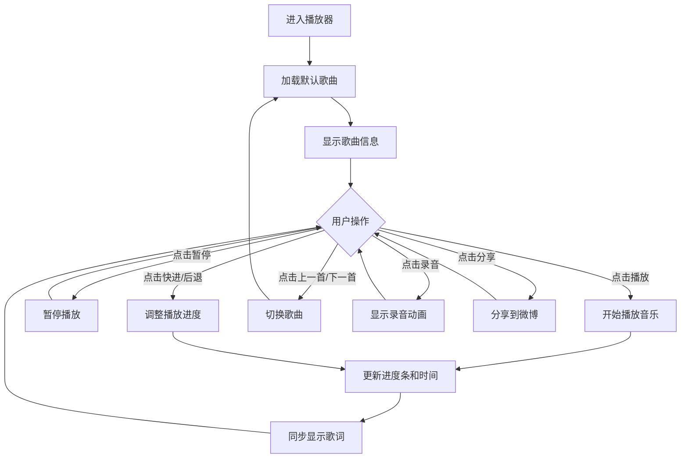

# 复古磁带播放器 - Pink Floyd 定制版

## 1. 产品概述

这是一款以复古磁带为设计风格的音乐播放器，专为 Pink Floyd 乐队粉丝定制。播放器采用深色太空背景，搭配金色和红色的复古色调，模拟真实磁带的外观和机械转动效果，为用户带来沉浸式的音乐体验。

- **核心目标**：为用户提供一个视觉独特、交互友好的音乐播放体验，特别针对 Pink Floyd 乐队的经典曲目。
- **目标用户**：Pink Floyd 乐队粉丝、复古音乐爱好者、追求独特视觉体验的音乐听众。

## 2. 核心功能

### 2.1 功能模块

我们的复古磁带播放器包含以下核心功能模块：

| 模块名称 | 功能描述 |
|---------|----------|
| 播放控制 | 播放/暂停、快进/后退、上一首/下一首 |
| 歌曲信息 | 显示歌曲名称、艺术家、专辑信息 |
| 进度显示 | 实时显示播放进度和时间 |
| 歌词同步 | 根据播放进度显示同步歌词 |
| 录音模拟 | 模拟录音功能，提供视觉反馈 |
| 分享功能 | 支持分享到社交媒体平台 |
| 键盘快捷键 | 支持空格键播放/暂停，方向键控制 |

### 2.2 页面详情

| 页面名称 | 模块名称 | 功能描述 |
|---------|---------|----------|
| 主播放页面 | 磁带外壳 | 复古磁带外观，带有齿轮转动动画，响应播放状态 |
| 主播放页面 | 歌曲信息 | 显示当前播放歌曲的名称、艺术家和专辑信息 |
| 主播放页面 | 进度条 | 显示歌曲播放进度，实时更新 |
| 主播放页面 | 时间显示 | 显示当前播放时间和歌曲总时长 |
| 主播放页面 | 歌词显示 | 同步显示当前歌曲歌词，高亮当前演唱部分 |
| 主播放页面 | 控制按钮 | 提供播放/暂停、快进/后退、上一首/下一首、录音按钮 |
| 主播放页面 | 分享按钮 | 提供分享到微博的功能 |

## 3. 核心流程

### 用户操作流程

1. **首次进入**：播放器加载默认歌曲，显示歌曲信息和控制界面
2. **播放控制**：
   - 点击播放按钮开始播放音乐
   - 点击暂停按钮暂停播放
   - 点击快进/后退按钮调整播放进度
   - 点击上一首/下一首按钮切换歌曲
3. **歌词浏览**：随着音乐播放，歌词会自动滚动并高亮当前演唱部分
4. **录音模拟**：点击录音按钮，按钮会显示录音动画效果
5. **分享**：点击分享按钮，可将播放器分享到微博
6. **键盘操作**：支持使用空格键播放/暂停，方向键控制歌曲和进度



## 4. 界面设计

### 4.1 设计风格

- **主色调**：深色太空背景 (#1a1a2e, #16213e, #0f0f23)，搭配金色 (#d4af37) 和红色 (#8B4513) 点缀
- **辅助色**：复古米色 (#e8e0d0, #d9ceb2)、粉红色 (#fc7a8f)
- **按钮风格**：金属质感，带有渐变和阴影效果，模拟真实磁带播放器按钮
- **字体**：使用无衬线字体，标题加粗，文字清晰易读
- **布局风格**：居中布局，响应式设计，适配不同屏幕尺寸
- **图标风格**：简约线条图标，搭配复古色彩

### 4.2 页面设计概述

| 页面名称 | 模块名称 | UI元素 |
|---------|---------|--------|
| 主播放页面 | 磁带外壳 | 复古米色磁带外壳，带有螺丝细节，中间为黑色磁带窗口，内部有旋转齿轮动画 |
| 主播放页面 | 标签区域 | 红色和黑色渐变标签，模拟真实磁带标签，带有Pink Floyd风格设计 |
| 主播放页面 | 棱镜效果 | 右侧带有白色棱镜和彩虹光束效果，致敬Pink Floyd经典专辑封面 |
| 主播放页面 | 歌曲信息 | 位于磁带下方，显示歌曲名称（金色）、艺术家（白色）和专辑（金色） |
| 主播放页面 | 进度条 | 黑色背景，金色渐变进度条，显示播放进度 |
| 主播放页面 | 时间显示 | 白色小字，显示当前播放时间和歌曲总时长 |
| 主播放页面 | 歌词显示 | 深色半透明背景，白色文字，当前歌词高亮显示为金色 |
| 主播放页面 | 控制按钮 | 金属质感按钮，播放/暂停按钮较大，其他按钮较小，排列整齐 |
| 主播放页面 | 分享按钮 | 位于右上角，圆形按钮，带有社交媒体图标 |

### 4.3 响应式设计

- **桌面端**：完整显示所有元素，磁带和控制区域较大
- **移动端**：自适应调整尺寸，确保所有元素在小屏幕上清晰可见
- **iPhone 13**：专门优化的布局，确保在iPhone 13屏幕上完美显示
- **竖屏模式**：调整布局为垂直排列，确保在竖屏状态下良好显示

## 5. 技术实现

### 5.1 技术栈

- **前端框架**：纯HTML5 + CSS3 + JavaScript
- **音频处理**：HTML5 Audio API
- **动画效果**：CSS3 Animation + JavaScript
- **响应式设计**：CSS Media Queries
- **字体**：系统默认无衬线字体

### 5.2 核心功能实现

1. **音乐播放控制**：使用HTML5 Audio API实现音频播放、暂停、进度调整等功能
2. **齿轮动画**：使用CSS3 Animation实现齿轮旋转效果，根据播放状态调整动画速度
3. **歌词同步**：解析歌词时间标签，根据当前播放时间显示对应歌词
4. **响应式布局**：使用CSS Media Queries适配不同屏幕尺寸
5. **键盘快捷键**：监听键盘事件，实现快捷键功能
6. **分享功能**：使用社交媒体分享API实现分享功能

### 5.3 数据结构

#### 歌曲数据结构

```javascript
const playlist = [
  {
    id: '4235817',           // 歌曲ID
    name: 'Wish You Were Here', // 歌曲名称
    artist: 'Pink Floyd',    // 艺术家
    album: 'Wish You Were Here', // 专辑
    cover: 'http://...',     // 专辑封面
    url: 'http://...',       // 音频URL
    lyrics: '[00:00.000] 作词 : Roger Waters\n...' // 歌词（带时间标签）
  },
  // 更多歌曲...
];
```

#### 歌词数据结构

```javascript
const currentLyrics = [
  { time: 0, text: '作词 : Roger Waters' },
  { time: 1, text: '作曲 : David Gilmour/Roger Waters' },
  { time: 95.434, text: 'So, so you think you can tell' },
  // 更多歌词行...
];
```

## 6. 浏览器兼容性

- **主流桌面浏览器**：Chrome、Firefox、Safari、Edge
- **移动浏览器**：iOS Safari、Android Chrome
- **最低分辨率**：320px（适配iPhone SE等小屏设备）

## 7. 性能优化

1. **音频预加载**：使用preload="metadata"属性，只加载音频元数据
2. **动画性能**：使用CSS3 transform和opacity属性实现动画，避免重排
3. **响应式图片**：根据屏幕尺寸加载合适大小的图片
4. **代码优化**：减少DOM操作，使用事件委托

## 8. 扩展性

1. **歌曲库扩展**：支持通过修改playlist数组添加更多歌曲
2. **主题定制**：可通过修改CSS变量实现主题颜色定制
3. **功能扩展**：可添加播放列表管理、音效调节等功能
4. **API集成**：可集成音乐服务API，实现歌曲搜索和播放

## 9. 总结

我们的复古磁带播放器为Pink Floyd粉丝和复古音乐爱好者提供了一个独特的音乐体验平台。通过精心设计的复古界面、流畅的动画效果和完整的功能集，用户可以在欣赏Pink Floyd经典曲目的同时，感受到复古音乐播放器的魅力。

播放器不仅实现了基本的音乐播放功能，还通过同步歌词、录音模拟等特色功能，增强了用户的沉浸感和交互体验。响应式设计确保了在各种设备上的良好显示效果，键盘快捷键则提供了更加便捷的操作方式。

作为一个前端项目，我们使用了现代的Web技术，实现了一个视觉效果出色、功能完整的音乐播放器，展示了前端开发在创建丰富用户体验方面的能力。